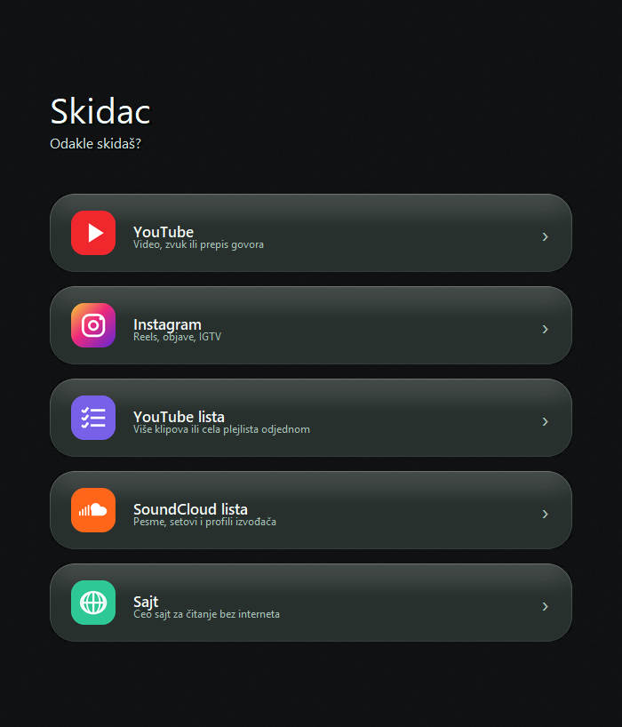
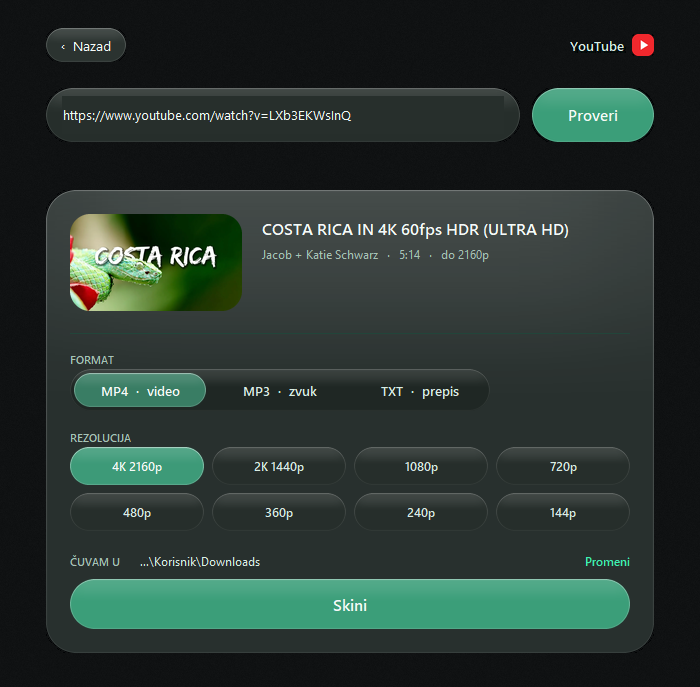
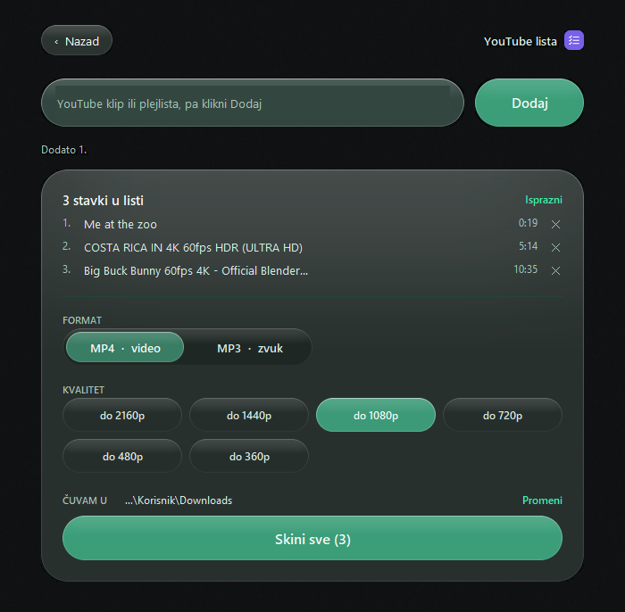
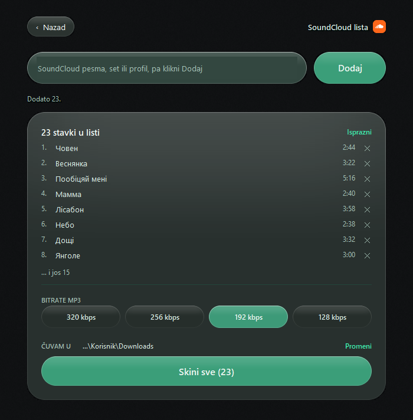
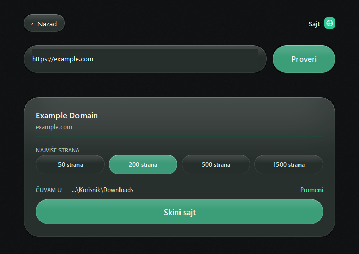

# Skidac

Windows aplikacija za skidanje sa YouTube-a, Instagrama i SoundCloud-a, kao i celih sajtova.



## Skidanje i instalacija

**[⬇ Skini Skidac.exe](https://github.com/danilomitic/ytconverter/releases/latest)**

1. Klikni na link gore i skini `Skidac.exe`
2. Dupli klik na fajl — aplikacija se odmah pokreće, ništa se ne instalira
3. Ako želiš ikonicu na Desktopu: desni klik na `Skidac.exe` → *Pošalji na* → *Radna površina*

Nije potreban Python ni bilo šta drugo — sve je unutar tog jednog fajla.

**Windows će pri prvom pokretanju prikazati plavi ekran „Windows protected your PC".**
To je zato što fajl nije digitalno potpisan (potpis se plaća), a ne zato što je nešto
sporno. Klikni **More info** pa **Run anyway**.

Provera da je fajl ispravan (opciono) — u PowerShell-u:

```powershell
Get-FileHash Skidac.exe -Algorithm SHA256
```

Mora da ispadne: `48e9f59f4aff37a959c5566e1e6a9a6dd4cdfbc8feaf313b7e97a481377a6ec7`

### Za pravljenje iz koda

Pokreni `build.bat` pa `install.bat` (traži Python i `ffmpeg.exe` u folderu).

## YouTube

Nalepi link, klikni **Proveri**, izaberi format i klikni **Skini**.

- **MP4** — video, do 4K
- **MP3** — samo zvuk
- **TXT** — tekst govora iz videa (samo ako video ima titlove)



## YouTube lista

Za više klipova odjednom. Nalepi link i klikni **Dodaj**, pa ponovi. Može i cela plejlista. Na kraju klikni **Skini sve**.



## SoundCloud lista

Isto kao YouTube lista, samo za SoundCloud. Nalepi pesmu, set ili profil izvođača. Sve se skida kao MP3.



## Instagram

Nalepi link reel-a ili objave. Ako objava traži prijavu, uključi **kolačiće iz Chrome-a** (moraš biti ulogovan u Chrome-u).

## Sajt

Skida ceo sajt da može da se otvori bez interneta. Izaberi koliko strana najviše, pa **Skini sajt**. Sajt se posle otvara preko `index.html`.



## Dobro je znati

- Folder za čuvanje menjaš klikom na **Promeni**.
- Dok skidanje traje, dugme postaje **Zaustavi**. Ono što je već skinuto ostaje.
- Prozor je providan, pa klik kroz prazan deo pada na program ispod. Prozor pomeraš za gornju traku.
